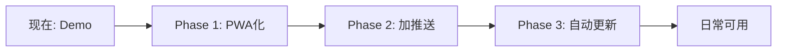

# 每日深度思辨 —— Demo 到日常可用产品架构方案

> 适用场景：个人自用，低维护，每日自动更新 + 主动触达 + 对话交互

---

## 现状分析

当前Demo技术栈：
- **前端**：HTML/CSS/JS（SPA，三视图路由）
- **后端**：Python FastAPI + LLM Client（端口8765）
- **数据**：静态Mock数据（手动维护）
- **部署**：本地 localhost

升级目标：
1. 每日自动从36氪抓取新闻并生成分析
2. 主动推送给用户（而非用户主动打开）
3. 跨设备可访问
4. 低运维成本（个人使用）

---

## 方案一：PWA + Vercel 部署

### 架构图

```
┌─────────────────────────────────────────────────────────┐
│                    用户设备（手机/电脑）                    │
│  ┌───────────────────────────────────────────────────┐  │
│  │              PWA (Service Worker)                  │  │
│  │  ┌─────────┐  ┌─────────┐  ┌──────────────────┐  │  │
│  │  │ 离线缓存 │  │ Web Push│  │  添加到主屏幕     │  │  │
│  │  │ (Workbox)│  │ (VAPID) │  │  (Manifest.json) │  │  │
│  │  └─────────┘  └─────────┘  └──────────────────┘  │  │
│  └───────────────────────────────────────────────────┘  │
└──────────────────────┬──────────────────────────────────┘
                       │ HTTPS
┌──────────────────────┴──────────────────────────────────┐
│                    Vercel / Netlify                      │
│  ┌──────────────────────────────────────────────────┐  │
│  │  静态站点托管（HTML/CSS/JS）                       │  │
│  │  + Serverless Functions（API路由）                │  │
│  └──────────────────────────────────────────────────┘  │
│  ┌──────────────────────────────────────────────────┐  │
│  │  Vercel Cron Jobs（每日定时触发）                  │  │
│  │  → 抓取36氪 → LLM分析 → 写入静态JSON              │  │
│  └──────────────────────────────────────────────────┘  │
└─────────────────────────────────────────────────────────┘
```

### 技术栈

| 层 | 选型 | 说明 |
|---|------|------|
| 前端框架 | 保持现有 HTML/CSS/JS | 无需重写，只需增加 Service Worker |
| PWA能力 | Workbox 7 | Google 官方 SW 工具库，离线缓存+预缓存 |
| 推送 | Web Push API + VAPID | 需生成 VAPID 密钥对，用户首次访问授权 |
| 静态托管 | Vercel (Hobby Plan) | 免费额度：100GB带宽/月，足够个人使用 |
| 定时任务 | Vercel Cron Jobs | 免费：每天最多1次（Hobby），Pro 可达每分钟 |
| API路由 | Vercel Serverless Functions | 将现有 Python FastAPI 改写为 Node.js/Edge Function |
| LLM调用 | 直接在 Serverless 中调用 DeepSeek API | 注意10s超时限制，需流式返回 |
| 域名 | 自定义域名绑定 | Vercel 一键配置，支持 SSL 自动签发 |
| 数据存储 | Vercel KV / 静态 JSON | 每日分析结果存为 JSON，前端 fetch 读取 |

### 核心模块

**1. Service Worker (`sw.js`)**
```
策略：
- 首页/precache：Cache First（HTML/JS/CSS）
- 每日分析数据：Network First（优先获取最新，离线时用缓存）
- 字体/图标：Stale-While-Revalidate（后台更新）

Workbox 配置示例：
- precacheAndRoute([...静态资源列表...])
- registerRoute(/api/, NetworkFirst)
- registerRoute(/\\.(png|woff2)/, StaleWhileRevalidate)
```

**2. Manifest.json**
```json
{
  "name": "每日深度思辨",
  "short_name": "深度思辨",
  "start_url": "/",
  "display": "standalone",
  "background_color": "#F7F3EC",
  "theme_color": "#1C1915",
  "icons": [{ "src": "/icon-192.png", "sizes": "192x192" }]
}
```

**3. Vercel Cron Job (`vercel.json`)**
```json
{
  "crons": [{
    "path": "/api/cron/daily-update",
    "schedule": "0 8 * * *"    // 每天早上8点执行
  }]
}
```

**4. 每日更新 Serverless Function (`api/cron/daily-update.js`)**
```
流程：
1. 请求36氪「八点一氪」API 或 抓取页面
2. 将今日新闻摘要传给 LLM（EVENT_SELECTION_PROMPT）
3. LLM 选出最值得深度分析的事件
4. 调用 ANALYSIS_GENERATION_PROMPT 生成多学科分析
5. 将结果写入 Vercel KV 或 /public/data/today.json
6. 触发 Web Push 通知用户
```

**5. Web Push 模块**
```
限制：iOS Safari 16.4+ 支持（需添加到主屏幕后）
Android Chrome 完全支持

推送流程：
- 用户访问 → 请求通知权限 → 生成 PushSubscription → 存储到 Vercel KV
- 每日更新完成后 → 遍历所有订阅 → 发送 Web Push
- 推送内容示例：{ title: "今日思辨已更新", body: "台积电在美追加1000亿美元...", icon: "/icon.png" }
```

### 部署流程

```bash
# 1. 安装 Vercel CLI
npm install -g vercel

# 2. 项目中增加 vercel.json 配置
# 3. 部署
vercel --prod

# 4. 绑定自定义域名
vercel domains add your-domain.com

# 5. 配置环境变量（API Key等）
vercel env add DEEPSEEK_API_KEY

# 6. 验证 Cron Job
vercel logs --cron
```

### 优缺点

| 优点 | 缺点 |
|------|------|
| 部署最简单，一条命令 | iOS Web Push 支持有限（需 PWA 安装后） |
| 免费额度充足 | Serverless 有 10s 执行时间限制 |
| 跨平台（浏览器即客户端） | LLM 调用在 Serverless 中受超时限制 |
| 自定义域名 + HTTPS 自动配置 | Python 后端需改写为 Node.js 或使用外部 API |

### 个人使用适配度：★★★★☆

适合你，前提是接受 iOS 推送限制（Android 完美）。最简单的"从 Demo 到日常"路径。

---

## 方案二：Telegram Bot + Web App

### 架构图

```
┌──────────────────────────────────────────────────────────┐
│                    Telegram 客户端                         │
│  ┌────────────────────────────────────────────────────┐  │
│  │  聊天界面                        内嵌 Web App       │  │
│  │  ┌──────────────┐         ┌──────────────────┐    │  │
│  │  │ Bot 消息推送  │  →点击→  │  每日深度思辨      │    │  │
│  │  │ "今日思辨已更新"│        │  (当前HTML/JS页面) │    │  │
│  │  │ [开始思辨]    │         │  完整对话交互      │    │  │
│  │  └──────────────┘         └──────────────────┘    │  │
│  └────────────────────────────────────────────────────┘  │
└────────────────────────┬─────────────────────────────────┘
                         │ Telegram Bot API (HTTPS)
┌────────────────────────┴─────────────────────────────────┐
│                    部署服务器                              │
│  ┌──────────────────────────────────────────────────┐  │
│  │  Python Bot 进程 (python-telegram-bot)            │  │
│  │  - 接收 /start 命令                               │  │
│  │  - 每日定时推送 (APScheduler)                     │  │
│  │  - 内嵌 Web App URL (InlineKeyboard)             │  │
│  └──────────────────────────────────────────────────┘  │
│  ┌──────────────────────────────────────────────────┐  │
│  │  FastAPI 服务（现有后端）                          │  │
│  │  - 对话 API (/api/dialogue/*)                    │  │
│  │  - Web App 页面服务                               │  │
│  └──────────────────────────────────────────────────┘  │
└─────────────────────────────────────────────────────────┘
```

### 技术栈

| 层 | 选型 | 说明 |
|---|------|------|
| Bot 框架 | python-telegram-bot v21 | 异步、最新、文档完善 |
| Web App | 现有 HTML/CSS/JS（微调） | Telegram Web App 本质是内嵌浏览器 |
| 定时任务 | APScheduler（在 Bot 进程内） | 无需外部 cron，轻量 |
| LLM调用 | 现有 llm_client.py（DeepSeek） | 直接复用，无超时限制 |
| 服务器 | 轻量云服务器（见方案四） | 也可以用 Railway / Fly.io 免费额度 |
| HTTPS | Nginx + Let's Encrypt | Bot API 要求 Webhook URL 为 HTTPS |
| 数据存储 | SQLite / JSON 文件 | 个人使用无需数据库 |

### 核心模块

**1. Bot 主进程 (`bot.py`)**

```python
from telegram import Update, InlineKeyboardButton, InlineKeyboardMarkup, WebAppInfo
from telegram.ext import Application, CommandHandler

async def start(update: Update, context):
    """用户发送 /start"""
    keyboard = [
        [InlineKeyboardButton("今日思辨", web_app=WebAppInfo(url="https://your-domain.com"))],
        [InlineKeyboardButton("开始对话", callback_data="dialogue")],
    ]
    await update.message.reply_text(
        "每日深度思辨 · 训练你的业务直觉\n\n"
        "点击下方按钮开始今天的思辨训练。",
        reply_markup=InlineKeyboardMarkup(keyboard)
    )

async def daily_push(context):
    """每日定时推送（由 APScheduler 触发）"""
    # 1. 抓取36氪新闻
    # 2. LLM 分析
    # 3. 存入最新分析结果
    # 4. 向所有已激活用户推送
    keyboard = [[InlineKeyboardButton(
        "开始今日思辨",
        web_app=WebAppInfo(url=f"https://your-domain.com/?event=today")
    )]]
    for chat_id in active_users:
        await context.bot.send_message(
            chat_id=chat_id,
            text=f"今日思辨已生成\n\n{event_title}",
            reply_markup=InlineKeyboardMarkup(keyboard)
        )
```

**2. Web App 适配**

Telegram Web App 是在 Telegram 内嵌浏览器中打开的网页，可以访问 Telegram Web App API：

```javascript
// 在现有 index.html 中增加
const tg = window.Telegram?.WebApp;

if (tg) {
  // 初始化 Telegram 主题
  tg.ready();
  tg.expand(); // 全屏展开

  // 适配 Telegram 主题色
  document.documentElement.style.setProperty(
    '--paper', tg.themeParams.bg_color || '#F7F3EC'
  );
  document.documentElement.style.setProperty(
    '--ink-black', tg.themeParams.text_color || '#1C1915'
  );

  // 主按钮（替代发送按钮）
  tg.MainButton.setText('发送').show().onClick(() => {
    Dialogue.sendMessage();
  });

  // 关闭 Web App 时保存状态
  tg.onEvent('viewportChanged', () => { /* ... */ });
}
```

**3. 推送通知**

```
Telegram Bot 的优势：
- 无需额外推送机制，Bot 直接发消息即推送
- 支持富文本（Markdown）+ 内嵌按钮
- 无 iOS/Android 差异
- 用户可以设置消息免打扰
- Web App 入口一键直达

推送文案模板：
┌─────────────────────────────────┐
│ 每日深度思辨 · 7月31日            │
│                                  │
│ 今日事件：台积电在美追加1000亿     │
│ 美元建设第三座先进晶圆厂           │
│                                  │
│ 核心张力：代工厂 → 地缘定价者      │
│                                  │
│         [开始今日思辨]            │
└─────────────────────────────────┘
```

**4. 多设备同步**

```
Telegram 天然跨平台：
- 手机端：推送 + Web App 对话（竖屏优化）
- 桌面端：推送 + Web App 对话（宽屏布局）
- Web 端：同上

对话状态可以通过 Telegram 的 callback_data 或 Web App sendData 在不同设备间同步
```

### 部署流程

```bash
# 1. 创建 Telegram Bot（@BotFather）
#    → 获取 BOT_TOKEN
#    → 设置 Menu Button 指向 Web App URL

# 2. 服务器部署
git clone <repo>
pip install -r requirements.txt
python bot.py &    # Bot 进程
python server.py &  # Web App 服务

# 3. 配置 Webhook（或使用 Polling）
# Webhook 模式需要 HTTPS：
curl "https://api.telegram.org/bot<TOKEN>/setWebhook?url=https://your-domain.com/webhook"

# 4. Nginx 配置
#    → 反向代理到 FastAPI (8765)
#    → SSL 证书 (Let's Encrypt)

# 5. 设置 Bot 命令列表（/setcommands）
start - 开始使用
today - 查看今日思辨
history - 往期回顾
```

### 优缺点

| 优点 | 缺点 |
|------|------|
| 推送能力最强（全平台原生通知） | 需要服务器（不能用纯 Serverless） |
| 无需审核、无需应用商店 | 用户必须安装 Telegram |
| Web App 内嵌，体验流畅 | Web App 内浏览器兼容性（Safari WebView） |
| 跨设备自动同步 | 依赖 Telegram 平台 |
| 当前 Python 后端可几乎零改动复用 | |

### 个人使用适配度：★★★★★

**最推荐**。你在手机上打开 Telegram 就能用，每天早上一推送就点进去思辨十分钟。零审核、零成本（用小服务器或 Railway 免费额度）、零平台锁定（Bot API 稳定十几年了）。

---

## 方案三：微信小程序

### 架构图

```
┌──────────────────────────────────────────────────────┐
│                   微信客户端                            │
│  ┌────────────────────────────────────────────────┐  │
│  │              每日深度思辨 小程序                  │  │
│  │  ┌─────────┐  ┌──────────┐  ┌───────────────┐ │  │
│  │  │ 今日要闻 │  │ 深度解读  │  │  思辨对话      │ │  │
│  │  │ (WXML)  │  │ (WXML)   │  │  (WXML+WS)    │ │  │
│  │  └─────────┘  └──────────┘  └───────────────┘ │  │
│  └────────────────────────────────────────────────┘  │
│  ┌────────────────────────────────────────────────┐  │
│  │  订阅消息：模板消息推送（用户主动订阅后）        │  │
│  └────────────────────────────────────────────────┘  │
└──────────────────────┬───────────────────────────────┘
                       │ wx.request / WebSocket
┌──────────────────────┴───────────────────────────────┐
│           微信云开发 / 自建后端                         │
│  ┌────────────────────────────────────────────────┐  │
│  │  云函数（定时触发器）                             │  │
│  │  → 抓取36氪 → LLM分析 → 写入云数据库            │  │
│  │  → 触发订阅消息推送                              │  │
│  └────────────────────────────────────────────────┘  │
│  ┌────────────────────────────────────────────────┐  │
│  │  云数据库                                        │  │
│  │  events 集合: { date, title, analysis, ... }   │  │
│  │  dialogues 集合: { userId, eventId, messages }  │  │
│  └────────────────────────────────────────────────┘  │
└──────────────────────────────────────────────────────┘
```

### 技术栈

| 层 | 选型 | 说明 |
|---|------|------|
| 框架 | 原生微信小程序 / Taro | Taro 可一套代码多端，但个人使用原生够用 |
| 后端 | 微信云开发（CloudBase） | 免服务器运维，自带数据库+云函数+定时触发 |
| 推送 | 订阅消息 | 用户需主动点击"订阅"按钮，每次订阅可推送1次 |
| LLM调用 | 云函数中调用 DeepSeek API | 需注意云函数 60s 超时限制 |
| 存储 | 云数据库（MongoDB 兼容） | 免费额度：2GB 存储 |

### 核心模块

**1. 页面结构**
```
pages/
├── index/          # 首页（三条事件卡片）
├── analysis/       # 分析页（Tab 切换）
├── dialogue/       # 对话页
└── history/        # 往期回顾
```

**2. 订阅消息**

微信小程序的推送限制（个人使用关键信息）：

```
- 必须用户主动触发订阅（点击按钮）
- 每次订阅可发送1条模板消息
- 模板需提前在后台申请（类目：工具 > 信息查询）
- 推送文案受限于模板格式

模板消息示例：
┌─────────────────────────────┐
│ 每日深度思辨                   │
│                              │
│ 今日事件：台积电在美追加投资     │
│ 核心视角：地缘定价者            │
│ 更新时间：2026-07-31 08:00    │
│                              │
│       [点击查看详情]           │
└─────────────────────────────┘
```

**3. 注册审核**

```
个人主体小程序：
- 注册微信公众平台 → 选择"小程序"
- 个人主体：无需企业资质，身份证即可
- 类目选择：工具 > 信息查询 / 效率
- 审核周期：1-7个工作日
- 限制：个人主体不能开通微信支付、不能使用部分API

注意：
- 类目需与"每日思辨"内容匹配
- 如果涉及新闻内容，可能需要"资讯"类目（审核更严）
- 建议以"个人效率工具/学习工具"定位提交
- 对话功能（LLM）需在隐私政策中说明
```

**4. 接口调用限制**

```
wx.request 并发限制：
- HTTPS 请求，域名需在后台配置（白名单）
- 最大并发数：10（wx.request）、5（wx.connectSocket）
- 单个请求超时：60s

这意味着：
- 对话中的 LLM 调用需要 WebSocket 或长轮询
- DeepSeek API 的流式响应可以转发为 WebSocket
- 或者用云函数作为中转（但有 60s 限制，需分段处理）
```

### 部署流程

```bash
# 1. 注册小程序 + 开通云开发
#    → 微信公众平台 mp.weixin.qq.com
#    → 开发者工具创建项目
#    → 开通云开发（环境ID）

# 2. 开发
#    用微信开发者工具编写 WXML/WXSS/JS
#    （现有 HTML 需要重写为小程序组件）

# 3. 云函数部署
#    在开发者工具中右键云函数 → 上传并部署
#    配置定时触发器：0 0 8 * * * *

# 4. 提交审核
#    上传代码 → 提交审核 → 等待通过 → 发布

# 5. 订阅消息模板申请
#    后台 → 功能 → 订阅消息 → 选择公共模板库
```

### 优缺点

| 优点 | 缺点 |
|------|------|
| 微信生态内触达 | 审核周期长（1-7天/次更新） |
| 订阅消息机制成熟 | 前端 HTML 需要完全重写为 WXML |
| 云开发免运维 | 推送限制：每次订阅仅1次推送 |
| 用户量大时可扩展 | 个人主体能力受限（无支付等） |
| | Python 后端不能直接复用 |

### 个人使用适配度：★★★☆☆

微信生态触达好，但审核负担对于"给自己用"来说太重了。每次更新代码都要审核，对话内容涉及 LLM 可能在内容审核上遇到问题。除非你有明确的微信生态分发需求，否则不推荐仅为自己使用而上小程序。

---

## 方案四：自部署服务器 + PWA

### 架构图

```
┌──────────────────────────────────────────────────────────┐
│                      用户设备                              │
│  ┌────────────────────────────────────────────────────┐  │
│  │  浏览器 → PWA (Service Worker + Manifest)          │  │
│  │  或 手机主屏幕快捷方式                               │  │
│  └────────────────────────────────────────────────────┘  │
└────────────────────────┬─────────────────────────────────┘
                         │ HTTPS
┌────────────────────────┴─────────────────────────────────┐
│              轻量云服务器（阿里云/腾讯云/华为云）            │
│                                                           │
│  ┌──────────────────────────────────────────────────┐   │
│  │                  Nginx (反向代理 + SSL)            │   │
│  │         /          →  静态文件 (HTML/CSS/JS)      │   │
│  │         /api/*     →  FastAPI (127.0.0.1:8765)    │   │
│  └──────────────────────────────────────────────────┘   │
│                                                           │
│  ┌──────────────────────────────────────────────────┐   │
│  │  FastAPI 服务（现有后端）                           │   │
│  │  + 静态文件服务 / + 对话 API / + 分析 API          │   │
│  └──────────────────────────────────────────────────┘   │
│                                                           │
│  ┌──────────────────────────────────────────────────┐   │
│  │  Cron Job (crontab)                               │   │
│  │  0 8 * * * python /app/scripts/daily_update.py    │   │
│  └──────────────────────────────────────────────────┘   │
│                                                           │
│  ┌──────────────────────────────────────────────────┐   │
│  │  ChromaDB (向量数据库)                             │   │
│  │  → 存储历史分析 embedding                         │   │
│  │  → 支持相似事件检索（"之前分析过类似的吗？"）        │   │
│  └──────────────────────────────────────────────────┘   │
│                                                           │
│  ┌──────────────────────────────────────────────────┐   │
│  │  推送模块                                          │   │
│  │  → Server酱（微信推送）/ Bark（iOS）/ 邮件         │   │
│  └──────────────────────────────────────────────────┘   │
└──────────────────────────────────────────────────────────┘
```

### 技术栈

| 层 | 选型 | 说明 |
|---|------|------|
| 服务器 | 阿里云轻量应用服务器 / 腾讯云轻量 | 2核2G，约 ¥40-60/月，个人够用 |
| 操作系统 | Ubuntu 22.04 LTS | Docker 支持好，社区成熟 |
| 反向代理 | Nginx + Let's Encrypt | SSL 自动续签 |
| 后端 | 现有 FastAPI（几乎零改动） | 直接复用 |
| 前端 | 现有 HTML/CSS/JS + PWA | 只需增加 sw.js + manifest.json |
| 定时任务 | Linux crontab | 最稳定可靠 |
| 向量数据库 | ChromaDB（嵌入式） | 轻量，无需单独部署，Python 直接调用 |
| 推送 | Server酱 / Bark / 邮件 | 个人使用最简单的推送方案 |
| 容器化 | Docker Compose | 一键启动所有服务 |

### 核心模块

**1. Docker Compose 编排**

```yaml
# docker-compose.yml
version: '3.8'
services:
  nginx:
    image: nginx:alpine
    ports: ["80:80", "443:443"]
    volumes:
      - ./nginx.conf:/etc/nginx/nginx.conf
      - ./static:/usr/share/nginx/html
      - ./ssl:/etc/nginx/ssl
    depends_on: [api]

  api:
    build: ./backend
    ports: ["8765:8765"]
    environment:
      - DEEPSEEK_API_KEY=${DEEPSEEK_API_KEY}
    volumes:
      - ./data:/app/data          # 分析结果持久化
      - ./chroma_db:/app/chroma_db # 向量数据库持久化

  cron:
    build: ./backend
    command: python /app/scripts/scheduler.py
    volumes:
      - ./data:/app/data
    environment:
      - DEEPSEEK_API_KEY=${DEEPSEEK_API_KEY}
```

**2. 每日更新脚本 (`scripts/daily_update.py`)**

```python
"""
每日执行流程：
1. 抓取36氪「八点一氪」内容
2. LLM 选出最值得分析的事件
3. LLM 生成多学科多维度分析
4. 将分析结果存入 JSON + ChromaDB
5. 触发推送通知
"""
import json
import httpx
from datetime import datetime
from pathlib import Path

async def daily_update():
    # 1. 获取新闻
    news = await fetch_36kr_daily()

    # 2. LLM 精选事件
    selected = await llm.chat(
        messages=[{"role": "user", "content": EVENT_SELECTION_PROMPT.format(
            news_summaries=news
        )}]
    )

    # 3. LLM 生成分析
    analysis = await llm.chat(
        messages=[{"role": "user", "content": ANALYSIS_GENERATION_PROMPT.format(
            news_content=selected
        )}]
    )

    # 4. 存储
    today = datetime.now().strftime("%Y-%m-%d")
    output = {
        "date": today,
        "event": json.loads(selected),
        "analysis": json.loads(analysis)
    }

    # 存为 JSON
    Path(f"data/{today}.json").write_text(json.dumps(output, ensure_ascii=False, indent=2))

    # 存入 ChromaDB（用于相似事件检索）
    collection.add(
        documents=[json.dumps(output)],
        metadatas=[{"date": today}],
        ids=[today]
    )

    # 5. 推送
    await send_push_notification(output)

    return output
```

**3. 向量数据库用途**

```
ChromaDB 在个人使用中的价值：

场景1：相似事件回溯
用户："这件事和之前哪次分析有关联？"
系统：检索 ChromaDB → 返回语义最相似的历史分析

场景2：趋势捕捉
每周自动分析本周事件 embedding 的变化趋势
生成周报："本周事件从'地缘政治'向'商业创新'偏移"

场景3：个人知识图谱
存储用户对话记录，构建个人思维脉络
```

**4. 推送方案（个人用）**

```
方案对比：

Server酱（推荐）：
- 免费，微信推送
- 一行代码：requests.post("https://sctapi.ftqq.com/<KEY>.send", data={"title": "...", "desp": "..."})
- 限制：免费版每天5条

Bark（iOS专用）：
- 免费，iOS 原生推送
- 自建服务：docker run bark-server
- 无推送限制

邮件：
- 最通用，无限制
- 配合 QQ邮箱/163邮箱 SMTP
- 简单可靠，但不如微信即时

推荐组合：Server酱（日常推送）+ 邮件（备份+长文）
```

**5. Nginx 配置**

```nginx
server {
    listen 443 ssl http2;
    server_name your-domain.com;

    ssl_certificate     /etc/nginx/ssl/fullchain.pem;
    ssl_certificate_key /etc/nginx/ssl/privkey.pem;

    # 静态文件（PWA）
    location / {
        root /usr/share/nginx/html;
        try_files $uri $uri/ /index.html;
    }

    # API 反向代理
    location /api/ {
        proxy_pass http://127.0.0.1:8765;
        proxy_set_header Host $host;
        proxy_set_header X-Real-IP $remote_addr;
        proxy_read_timeout 120s;  # LLM 对话可能较长
    }
}
```

### 部署流程

```bash
# 1. 购买服务器
#    阿里云轻量应用服务器 2核2G / Ubuntu 22.04
#    → 获得公网 IP
#    → 配置安全组：开放 80/443

# 2. 域名 + DNS
#    购买域名 → DNS A 记录指向服务器 IP
#    → 等待解析生效

# 3. SSH 登录服务器
ssh root@<服务器IP>

# 4. 安装 Docker
curl -fsSL https://get.docker.com | sh

# 5. 克隆项目
git clone <repo> /app/daily-insight
cd /app/daily-insight

# 6. 配置环境变量
cp .env.example .env
# 编辑: DEEPSEEK_API_KEY=sk-xxx
#       PUSH_KEY=xxx  (Server酱 Key)

# 7. 初始化 SSL 证书
docker run --rm -v $(pwd)/ssl:/etc/letsencrypt \
  certbot/certbot certonly --standalone \
  -d your-domain.com

# 8. 启动服务
docker-compose up -d

# 9. 手动测试每日更新
docker-compose exec api python /app/scripts/daily_update.py

# 10. 配置 crontab（在宿主机）
crontab -e
# 0 8 * * * docker exec daily-insight-api-1 python /app/scripts/daily_update.py
```

### 优缺点

| 优点 | 缺点 |
|------|------|
| 完全自主可控 | 需要维护服务器 |
| Python 后端几乎零改动 | 月费 ¥40-60 |
| 无平台限制 | 需要自己处理 SSL 续签 |
| 可以加任何功能（向量DB、邮件推送等） | 推送需要第三方工具辅助 |
| 支持 PWA + 完整的离线体验 | |

### 个人使用适配度：★★★★☆

如果你喜欢"一切都自己掌控"的感觉，这是最好的方案。服务器成本很低（每月一杯咖啡钱），Python 代码几乎不需要改。PWA 安装后体验接近原生 App。额外的好处是你可以慢慢加入向量数据库、知识图谱等更高级的功能。

---

## 综合对比

| 维度 | PWA + Vercel | Telegram Bot | 微信小程序 | 自部署服务器 |
|------|:---:|:---:|:---:|:---:|
| **部署难度** | ★☆☆☆☆ | ★★☆☆☆ | ★★★★☆ | ★★★☆☆ |
| **推送能力** | ★★★☆☆ | ★★★★★ | ★★★☆☆ | ★★★☆☆ |
| **代码改动量** | ★★★☆☆ | ★★☆☆☆ | ★★★★★ | ★☆☆☆☆ |
| **月费成本** | ¥0 | ¥0~30 | ¥0 | ¥40-60 |
| **审核依赖** | 无 | 无 | 有（1-7天） | 无 |
| **跨平台** | ★★★★☆ | ★★★★★ | ★★★☆☆ | ★★★★☆ |
| **离线能力** | ★★★★★ | ★★☆☆☆ | ★★★☆☆ | ★★★★★ |
| **扩展性** | ★★☆☆☆ | ★★★☆☆ | ★★★☆☆ | ★★★★★ |

---

## 我的推荐

**如果你只选一个：Telegram Bot + 轻量服务器。**

理由很简单：
- 你是自己用，不是做产品。Telegram 天然解决了"如何触达自己"的问题——每天早上一推，点进去就思辨。不需要你记得打开网页。
- 现有 Python 代码几乎零改动。FastAPI 后端照跑，HTML 前端作为 Telegram Web App 打开。
- Telegram 全平台覆盖。你换手机、换电脑，同一个 Bot 一直在那里。
- 没有任何审核流程。Bot Token 一创建就能用。
- 如果未来想做 PWA，Telegram Web App 和 PWA 的代码完全兼容——本质是同一个网页。

**如果追求极致简单：PWA + Vercel。**
不需要服务器，一条 `vercel` 命令部署。iOS 推送弱但 Android 完美。适合"我每天早上自己记得打开"的自律型用户。

**服务器方案是最佳未来-proof。**
一个月后你想加 ChromaDB 做历史检索、想训练自己的思考模型、想加邮件周报——服务器方案给你全部的自由。Docker Compose 一键部署也不复杂。

---

## 实施建议



分三步走：
1. **本周**：给现有 Demo 加 PWA（Service Worker + Manifest），部署到 Vercel
2. **下周**：创建 Telegram Bot + 每日定时脚本，实现"早上推送到手机，点开即用"
3. **一个月后**：如果每天都用，搬到自己服务器上，加 ChromaDB、加邮件周报
